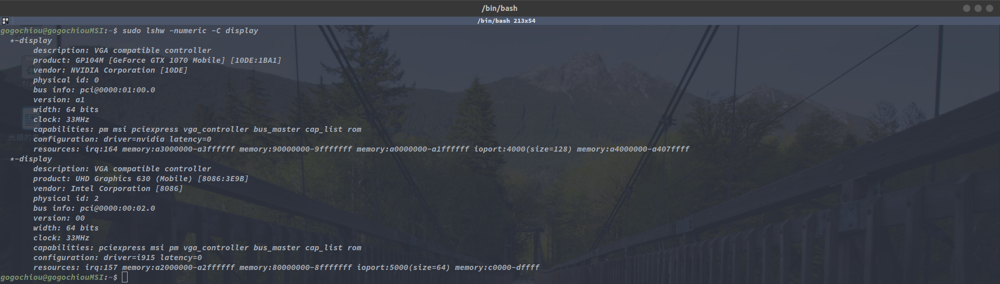
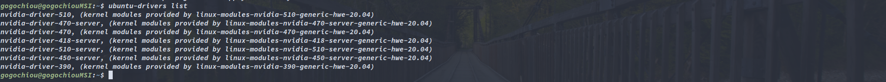
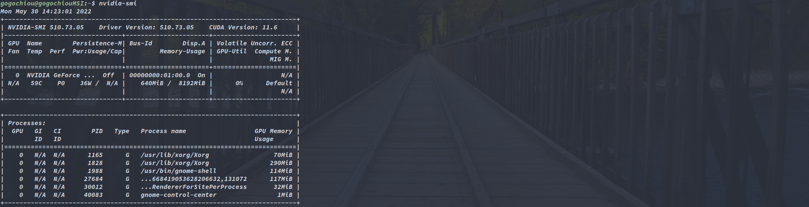
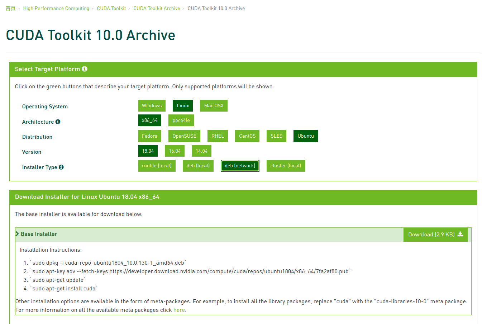
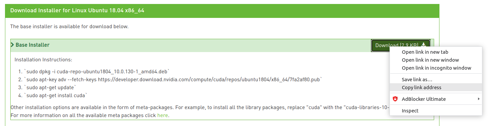
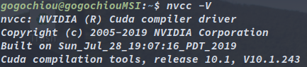
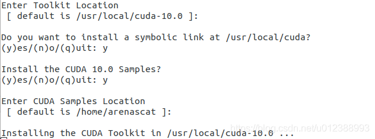
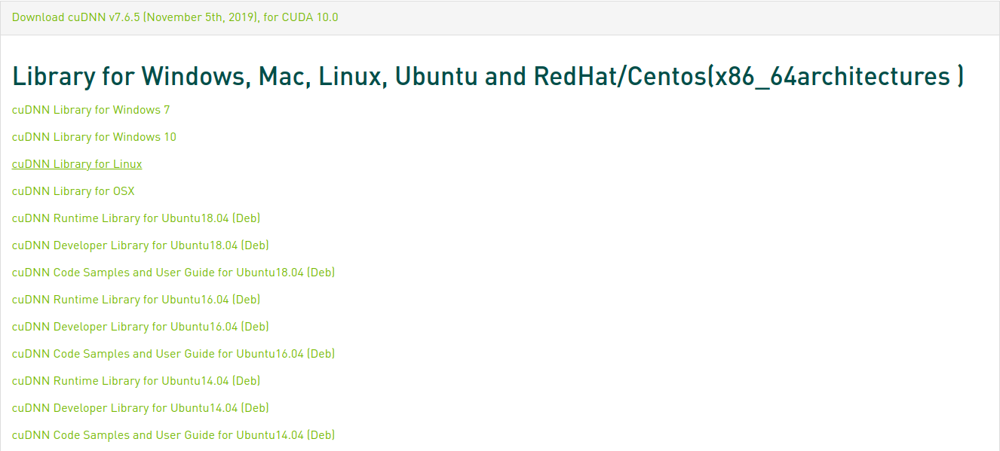

# Setting Learning Environment (Python) #

> My Work Environment -
>
>1. Operating System : Linux ubuntu 20.04 / 18.04
>
>2. GPU : Nvidia GeForce GTX 1070

## GPU Driver ##

> For Nvidia GPU, and types belows command in terminal.

1. Check system GPU information

        sudo lshw -numeric -C display

    

2. Delete existing GPU driver **(Optional)**

        sudo apt-get purge nvidia*

3. Add GPU PPA (personal package archives)

        sudo add-apt-repository ppa:graphics-drivers

4. Update and Upgrade

        sudo apt-get update
        sudo apt upgrade

5. List all supported drivers

        ubuntu-drivers list

    

6. Install feasible driver ( I just choose the latest one )

        sudo apt install nvidia-driver-510

7. Rebbot system

        sudo reboot

8. Check if installation success

        nvidia-smi

    

## Cuda Installation ##

> Using ubuntu 18.04 and cuda 10.0 as example. ( For tensorflow 1.15 )

### General Way ###

1. Go to [Nvidia_Developer cuda toolkit archive](https://developer.nvidia.com/cuda-toolkit-archive)

2. Choose your desired cuda toolkit version

3. Follow steps of official website

    - Download base installer, just click **'Download'** button (If you don't have GUI, that is you just can use command line to work, go to [STEP 4](#wget))

    - Follow installation instructions 

    

4. Using **wget** to download base installer 

    - Right click on the **'Download'** button, and copy the link adress

        

    - Use wget command

            wget <copy_link>

    - Back to follow [installation instructions](#wbsite_step)

5. Open **.bashrc**

        code ~/.bashrc
        ## you can use any way to open this file, code may not be feasible for you.

6. Add environment variable and save the file

        ## For Cuda
        export LD_LIBRARY_PATH=$LD_LIBRARY_PATH:/usr/local/cuda/lib64
        export PATH=$PATH:/usr/local/cuda/bin

7. Reuse (or reopen) the terminal (bash)

        source ~/.bashrc

8. Check if installation success

        nvcc -V

    

    
     
    
This is cuda 10.1 version

    

### Other Way for CUDA 10.0 ###

1. Download CUDA 10.0

        wget https://developer.nvidia.com/compute/cuda/10.0/Prod/local_installers/cuda_10.0.130_410.48_linux

2. Make file executable

        sudo chmod +x cuda_10.0.130_410.48_linux

3. Execure the file

        sudo cuda_10.0.130_410.48_linux

4. Press enter until question part occurs, then follow belows selection (without install driver)

    

    After installing, there might be a warning about GPU driver, because we didn't install it. Don't be worry about this problem, it is alright.

5. Also open **.bashrc** and add environment variable

        export CUDA_HOME=/usr/local/cuda
        export LD_LIBRARY_PATH=/usr/local/cuda/lib64:"$LD_LIBRARY_PATH:/usr/loacl/cuda/lib64:/usr/local/cuda/extras/CUPTI/lib64"
        export PATH=/usr/local/cuda/bin:$PATH

6. Reuse (or reopen) the terminal (bash)

        source ~/.bashrc

7. Check if installation success

        nvcc -V

## cuDNN ##

> Using ubuntu 18.04 and cuda 10.0 as example.

1. Go to [official website](https://developer.nvidia.com/rdp/cudnn-archive), and choose feasible version

    

2. Download **cuDNN Library for linux**, which is a tar file, then unzip it

        tar -xzvf cudnn-10.0-linux-x64-v7.6.5.32.tgz

3. Copy file to cuda files

        sudo cp cuda/include/cudnn.h /usr/local/cuda/include
        sudo cp cuda/lib64/libcudnn* /usr/local/cuda/lib64
        sudo chmod a+r /usr/local/cuda/include/cudnn.h /usr/local/cuda/lib64/libcudnn*

4. Also Download **cuDNN Code Samples and User Guide for Ubuntu18.04**, which is used for checking if installation success, so it is optianal. Also, we can download **cuDNN Runtime Library** + **cuDNN Developer Library** instead of **cuDNN Library for linux**, previous combination is deb file, and the latter one is tar file

5. Install **cuDNN Code Samples and User Guide for Ubuntu18.04** deb file

        sudo dpkg -i libcudnn7-doc_7.6.5.32-1+cuda10.0_amd64.deb

6. Check if cuDNN works

        cp -r /usr/src/cudnn_samples_v8/ $HOME
        cd $HOME/cudnn_samples_v8/mnistCUDNN
        make clean && make
        ./mnistCUDNN

## Python virtual environment ##

> Virtualenv is used in my case, you can also choose docker or anaconda...etc.

1. Install virtualenv

        sudo apt-get install python3-pip
        pip3 install virtualenv

2. Construct an environment

## Reference ##

- [深度學習環境安裝筆記](https://ithelp.ithome.com.tw/articles/10191457)

- [Ubuntu 20.04中安裝nvidia-driver-460版 & CUDA-11.4.2版 & cuDNN](https://medium.com/@scofield44165/ubuntu-20-04%E4%B8%AD%E5%AE%89%E8%A3%9Dnvidia-driver-cuda-11-4-2%E7%89%88-cudnn-install-nvidia-driver-460-cuda-11-4-2-cudnn-6569ab816cc5)

- [Ubuntu 安裝 CUDA cuDNN pytorch tensorflow mxnet](https://mikethreeacer.medium.com/ubuntu-18-04-%E5%AE%89%E8%A3%9D-cuda-cudnn-anaconda-pytorch-1f170b3326a4#1b0a)

- [解决Could not load dynamic library 'libcudart.so.10.0'的问题](https://blog.csdn.net/u012388993/article/details/102573117)

- [Which TensorFlow and CUDA version combinations are compatible?](https://stackoverflow.com/questions/50622525/which-tensorflow-and-cuda-version-combinations-are-compatible)

- [VSCode 2/5: 設定虛擬環境 Virtual Env，管理 Python 專案！](https://pythonviz.com/vscode/visual-studio-code-virtual-environment-setup/)