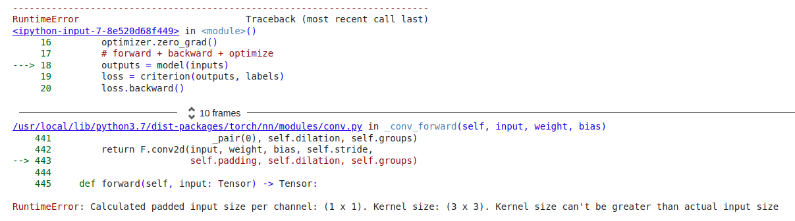

# Problem solution #

> This is for the solution of my problem during working on HW2

## Problem 1 ##


It is the problem when I training the param of batch_size. The problem is causing by **nn.BatchNorm layer**, which will need more than one data as input, hence the error occurs.

In my case, my data is 500 training data and 100 testing data, each data is an image with size of 32\*32\*3 (RGB). If my batch size setting as 33, then the problem will occur.

  ```python
  # setting train and test set
  trainset = torchvision.datasets.CIFAR100(root='./data', train=True,
                                          download=True,transform=train_transform)
  trainloader = torch.utils.data.DataLoader(trainset, batch_size=batch_size,
                                          shuffle=True, num_workers=2)
  testset = torchvision.datasets.CIFAR100(root='./data', train=False,
                                          download=True, transform=test_transform)
  testloader = torch.utils.data.DataLoader(testset, batch_size=batch_size,
                                          shuffle=False, num_workers=2)
  
  # training
  ...#skip

  # testing
  with torch.no_grad():
    for data in testloader:
      images, labels = data
      images = images.to(device)
      labels = labels.to(device)
      # calculate outputs by running images through the network
      outputs = model(images) 
      # the class with the highest energy is what we choose as prediction
      _, predicted = torch.max(outputs.data, 1)
      total += labels.size(0)
      correct += (predicted == labels).sum().item()
  ```

The most easy way to avoid this problem is to properly setting the batch_size, another solution is add param **drop_last = true** in to DataLoader, it will abandon remain datas that was less than batch_size, I'm not sure if it is a good solution. Still, setting validation data is also a solution, just call **model.eval()** before training.

### Unsolved : ###

1. Why setting validation works?

2. Why error happens during testing since it is an training problem

### Reference : ###

1. [pytorch的小坑 - BatchNorm problem](https://blog.csdn.net/yy19980310/article/details/117827682)

2. [Using model.eval()](https://discuss.pytorch.org/t/error-expected-more-than-1-value-per-channel-when-training/26274)

3. [Using " drop_last " param](https://www.cnblogs.com/zmbreathing/p/pyTorch_BN_error.html)

4. [What is batch, epoch, num of iterations](https://ithelp.ithome.com.tw/articles/10277163)

---

## Problem 2 - what is **model.eval()** ? ##

### Reference : ###

1. [Pytorch : train和eval用法與區別](https://zhuanlan.zhihu.com/p/357075502)

## Problem 3 - inception V3 ##



My input image is 32\*32\*3 (RGB), however, the inceptionV3 in pytorch require size of 299\*299\*3, so it might occur this problem. Maybe there is some way to modify the kernel making it possible.

### Reference : ###

1. [Error occurring in inceptionV3](https://discuss.pytorch.org/t/error-occurring-in-inception-v3-network/47169)