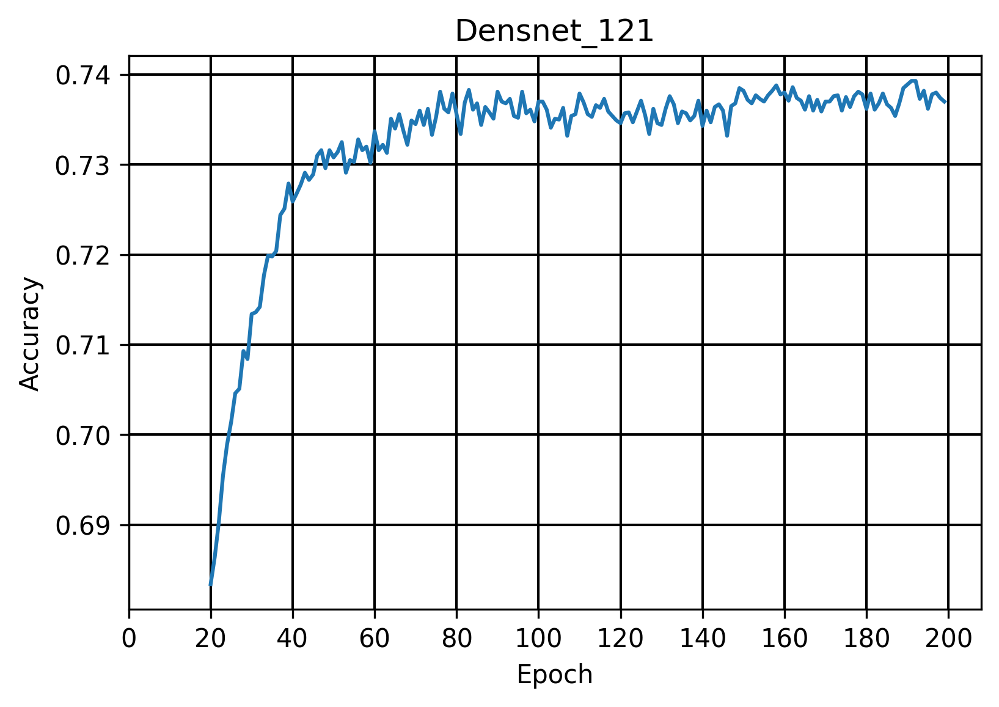

<!-- # Testing Record # -->
# NYCU ML 2022 - HW2 #

> Student : M093839 邱柏鎧

## Test1 ##

> Abstract : <br>
  &emsp; Different batch_size effect.<br>
  Usage : <br>
  &emsp; Model = ResNet50<br>
  &emsp; Epoch = 20<br>
  &emsp; Optimizer = Adam<br>

- Result :

  <table>
    <tr>
      <td><strong>Epoch (generation)</strong></td>
      <td>32</td>
      <td>64</td>
      <td>96</td>
      <td>128</td>
      <td>160</td>
    </tr>
    <tr>
      <td><strong>Accuracy</strong></td>
      <td>59.53%</td>
      <td>62.55%</td>
      <td>62.98%</td>
      <td>62.47%</td>
      <td>63.33%</td>
    </tr>
  </table>

  <p><center>
    <font size="4">Batch_size and accuracy</font>
    
  </center></p>

- Conclusion :

  We can see that accuracy will increase as the batch_size become larger in most case, and there is a huge gap between batch_size=32 and others, it seems that the best decision is using batch_size=160 (or more).<br>
  However, the larger batch_size is, the longer time should be undergoing theoretically. Combining two siginificant effect, since batch_size of 160 is only slightly better than 64, we choose 64 for latter tests.

---

## Test2 ##

> Abstract : <br>
  &emsp; Changing Std and Mean.<br>
  Usage : <br>
  &emsp; Model = ResNet50<br>
  &emsp; Batch_size = 32<br>
  &emsp; Epoch = 20<br>
  &emsp; Optimizer = Adam<br>

- Result :

  - Accuracy = 60.61% (origin)

    ```python
    mean = (0.5071, 0.4867, 0.4408)
    std = (0.2675, 0.2565, 0.2761)
    ```

  - Accuracy = 60.27% (modify)

    ```python
    mean = (0.4914, 0.4822, 0.4465)
    std = (0.2023, 0.1994, 0.2010)
    ```

- Conclusion :

  It seems that both calculation is correct, since the results are similar.

- Reference :

  1. [How to calculate mean and std for normalization](https://www.geeksforgeeks.org/how-to-normalize-images-in-pytorch/)

---

## Test3 ##

> Abstract : <br>
  &emsp; Different Epoch effect.<br>
  Usage : <br>
  &emsp; Model = ResNet50<br>
  &emsp; Batch_size = 32<br>
  &emsp; Optimizer = Adam<br>

- Result :
  - Wide Range - 20~200

    <table>
      <tr>
        <td><strong>Epoch (generation)</strong></td>
        <td>20</td>
        <td>50</td>
        <td>100</td>
        <td>150</td>
        <td>200</td>
      </tr>
      <tr>
        <td><strong>Accuracy</strong></td>
        <td>61.49%</td>
        <td>61.61%</td>
        <td>61.64%</td>
        <td>61.98%</td>
        <td>61.82%</td>
      </tr>
    </table>

  - Narrow Range (odd) - 155~195

    <table>
      <tr>
        <td><strong>Epoch (generation)</strong></td>
        <td>155</td>
        <td>165</td>
        <td>175</td>
        <td>185</td>
        <td>195</td>
      </tr>
      <tr>
        <td><strong>Accuracy</strong></td>
        <td>60.87%</td>
        <td>61.18%</td>
        <td>60.22%</td>
        <td>60.55%</td>
        <td>61.07%</td>
      </tr>
    </table>

  - Narrow Range (even) - 160~190

    <table>
      <tr>
        <td><strong>Epoch (generation)</strong></td>
        <td>150</td>
        <td>160</td>
        <td>170</td>
        <td>180</td>
        <td>190</td>
      </tr>
      <tr>
        <td><strong>Accuracy</strong></td>
        <td>61.97%</td>
        <td>60.87%</td>
        <td>61.24%</td>
        <td>61.05%</td>
        <td>62.03%</td>
      </tr>
    </table>

  - Total Range - 20~200

    <table>
      <tr>
        <th colspan="10"><center>Result 1</center></th>
      </tr>
      <tr>
        <td><strong>Epoch (generation)</strong></td>
        <td>20</td>
        <td>50</td>
        <td>100</td>
        <td>150</td>
        <td>160</td>
        <td>170</td>
        <td>180</td>
        <td>190</td>
        <td>200</td>
      </tr>
      <tr>
        <td><strong>Accuracy</strong></td>
        <td>60.63%</td>
        <td>61.47%</td>
        <td>61.97%</td>
        <td>61.56%</td>
        <td>61.76%</td>
        <td>61.47%</td>
        <td>61.34%</td>
        <td>60.52%</td>
        <td>61.79%</td>
      </tr>
      <tr>
        <th colspan="10"><center>Result 2</center></th>
      </tr>
      <tr>
        <td><strong>Epoch (generation)</strong></td>
        <td>20</td>
        <td>50</td>
        <td>100</td>
        <td>150</td>
        <td>160</td>
        <td>170</td>
        <td>180</td>
        <td>190</td>
        <td>200</td>
      </tr>
      <tr>
        <td><strong>Accuracy</strong></td>
        <td>61.15%</td>
        <td>60.92%</td>
        <td>61.14%</td>
        <td>60.79%</td>
        <td>60.34%</td>
        <td>61.15%</td>
        <td>60.64%</td>
        <td>60.86%</td>
        <td>60.87%</td>
      </tr>
      <tr>
        <th colspan="10"><center>Result 3</center></th>
      </tr>
      <tr>
        <td><strong>Epoch (generation)</strong></td>
        <td>20</td>
        <td>50</td>
        <td>100</td>
        <td>150</td>
        <td>160</td>
        <td>170</td>
        <td>180</td>
        <td>190</td>
        <td>200</td>
      </tr>
      <tr>
        <td><strong>Accuracy</strong></td>
        <td>61.24%</td>
        <td>61.12%</td>
        <td>62.07%</td>
        <td>61.88%</td>
        <td>61.64%</td>
        <td>62.19%</td>
        <td>62.22%</td>
        <td>61.67%</td>
        <td>61.67%</td>
      </tr>
    </table>

<!--
data 1
60.63% 20
61.47% 50
61.97% 100
61.56% 150
61.76% 160
61.47% 170
61.34% 180
60.52% 190
61.79% 200
data 2
61.15% 20
60.92% 50
61.14% 100
60.79% 150
60.34% 160
61.15% 170
60.64% 180
60.86% 190
60.87% 200
data 3
61.24% 20
61.12% 50
62.07% 100
61.88% 150
61.64% 160
62.19% 170
62.22% 180
61.67% 190
61.67% 200
-->

- Conclusion :

  There is no absolute consequence for epoch's effect, since different data combination might differ the result. However, we can roughly conclude that the higher epoch we produce, the higher probability to get better performence, or just ran 200 epoch and find the best accuracy for each different model and parameters.

---

## Test4 ##

> Abstract : <br>
  &emsp; Trying Data Augmentation.<br>
  Usage : <br>
  &emsp; Model = ResNet50<br>
  &emsp; Batch_size = 64<br>
  &emsp; Epoch = 20<br>
  &emsp; Optimizer = Adam<br>

### Random Adding ###

- Result :

  1. Accuracy = 57.88% (Without any augmentation)

  2. Accuracy = 56.86% (Crop + HorizontalFlip + RandomRotation)

      ```python
      train_transform = transforms.Compose(
        [transforms.RandomCrop(32, padding=4),
        transforms.RandomHorizontalFlip(),
        transforms.RandomRotation(15),
        transforms.ToTensor(),
        transforms.Normalize(mean, std)])
      ```

  3. Accuracy = 60.52% (HorizontalFlip - TA's basic way)

  4. Accuracy = 41.44% (HorizontalFlip + VerticalFlip + Affine + Grayscale)

      ```python
      train_transform = transforms.Compose(
      [transforms.RandomHorizontalFlip(p=0.5),
      transforms.RandomVerticalFlip(p=0.5),
      transforms.RandomAffine(45,(0.1,0.1),(0.5,2),(0,45)),
      transforms.RandomGrayscale(p=0.5),
      transforms.ToTensor(),
      transforms.Normalize(mean, std)])
      ```

  5. Accuracy = 57.74% (VerticalFlip + HorizontalFlip - p = 0.5)

  6. Accuracy = 57.74% (VerticalFlip + HorizontalFlip - p = 0.25)

  7. Accuracy = 55.79% (Randomcrop + VerticalFlip)

      ```python
      train_transform = transforms.Compose(
        [transforms.RandomCrop(32, padding=4),
        transforms.RandomVerticalFlip(p=0.5),
        transforms.ToTensor(),
        transforms.Normalize(mean, std)])
      ```

- Reference :

  1. [常用图像处理与数据增强方法合集（torchvision.transforms)](https://blog.csdn.net/qq_42951560/article/details/109852790)

  2. ["TRANSFORMING AND AUGMENTING IMAGES" - Pytorch office web](https://pytorch.org/vision/stable/transforms.html)

  3. [Data Augmentation in Pytorch](https://stackoverflow.com/questions/51677788/data-augmentation-in-pytorch)

- Conclusion :

  It seems that more data augmentation reduce the accuracy, i guess the problem is that for complex model, quantity of cifar100 data set is not enough, even not suitable for using cross validation. So there are some other ways to deal with this issue, and i will try them for latter test.

### RandomErasing ###

- Result :

  - Accuracy = 61.07% ( batch_size = 64 ) / 58.88% ( batch_size = 32 )

    ```python
    train_transform = transforms.Compose(
    [transforms.RandomCrop(32, padding=4),
     transforms.RandomHorizontalFlip(p=0.5),
     transforms.ToTensor(),
     transforms.Normalize(mean, std),
     transforms.RandomErasing(p=0.5, scale=(0.02,0.4), ratio=(0.3, 3.3))])
    ```

  - Accuracy = 61.15% (modify mean and std as paper)

- Reference :

  1. [Random Erasing Augmentation - CSDN介紹](https://blog.csdn.net/xuluohongshang/article/details/79000951)

  2. ["RandomErasing" - Pytorch office web](https://pytorch.org/vision/stable/generated/torchvision.transforms.RandomErasing.html)

  3. ["Random Erasing Data Augmentation" Paper Code - github](https://github.com/zhunzhong07/Random-Erasing)

- Conclusion :

  There might be some misunderstanding when i implement the papper's idea, or this solution is not fitting my expectation.

---

## Test5 ##

> Abstract : <br>
  &emsp; Optimizer test.<br>
  Usage : <br>
  &emsp; Model = ResNet50<br>
  &emsp; Batch_size = 64<br>
  &emsp; Epoch = 20<br>

### SGD & Adam with different learning rate and weight_decay ###

- Result :

  1. Adam ( lr = 0.0001 ; wd = 1e-4 ) -- 60.94%

  2. Adam ( lr = 0.0001 ; wd = 5e-4 ) -- 60.90%

  3. Adam ( lr = 0.1 ; wd = 1e-4 ) -------- 0.88%

  4. SGD ( lr = 0.0001 ; wd = 5e-4 ) ----- 63.97% | 64.54%

  5. SGD ( lr = 0.1 ; wd = 5e-4 ) ----------- 38.75%

  6. SGD ( lr = 0.0001 ; wd = 1e-4 ) ----- 64.83% || 15min44s

  ```python
  optimizer = optim.Adam(model.parameters(), lr=0.0001, weight_decay=5e-4)
  optimizer = optim.SGD(model.parameters(), lr=0.0001, momentum=0.9,weight_decay=5e-4)
  ```

- Conclusion :

  SGD behaves better than Adam in my test, many other paper also maintain using SGD as the optimizer. We can also find that when learning-rate is 0.0001 and weight-decay is 1e-4, the best performence occurs, i wish to continue reducing learning-rate, however training time will simutaneously increase, so i also try using dynamic lr.

### Dynamic learning rate ###

- Aim :

  Increase Number of Epoch can improve accuracy, however, it will also take lots of time for training. Let learning rate be dynamic can theoretically reduce time but maintain well behavior of model.

- Modify :

  ```python
  optimizer = optim.SGD(model.parameters(), lr=0.1, momentum=0.9, weight_decay=1e-4)
  def get_lr(optimizer):
      for param_group in optimizer.param_groups:
          return param_group['lr']

  # dynamic learning rate
  train_scheduler = optim.lr_scheduler.MultiStepLR(optimizer, milestones=[60,120,160], gamma=0.2)

  # training part
  for epoch in range(total_epoch):
    check_lr = get_lr(optimizer)
    lrs.append(check_lr)
    for i, data in enumerate(trainloader, 0):
        ......
        # forward + backward + optimize
        outputs = model(inputs)
        loss = criterion(outputs, labels)
        loss.backward()
        optimizer.step()
    train_scheduler.step()
    torch.save(model, save_path)
  ```

- Result :

  | Type            | Accuracy | Time      |
  | ---             | :---:    | ---       |
  | Adam_20         | 61.34    | 13m12s    |
  | SGD_20          | 64.31    | 11m20s    |
  | SGD_200         | 65.20    | 1hr52m34s |
  | SGD_200_dynamic | 55.12    | 1hr51m56s |

  \* 20 or 200 means epoch

  <p align="center">
    <font size="4">Learning rate in each epoch</font><br>
    
  </p>

<!--
  學習成果差，可以考慮加入[warm-up](https://chih-sheng-huang821.medium.com/%E6%B7%B1%E5%BA%A6%E5%AD%B8%E7%BF%92warm-up%E7%AD%96%E7%95%A5%E5%9C%A8%E5%B9%B9%E4%BB%80%E9%BA%BC-95d2b56a557f)的方法，但是我們現在連速度都沒便快QQ。
-->

- Reference :

  1. [Image Classification of CIFAR100 Dataset Using PyTorch](https://blog.jovian.ai/image-classification-of-cifar100-dataset-using-pytorch-8b7145242df1)

  2. [Pytorch_學習效率調整法](https://blog.csdn.net/weixin_48249563/article/details/115031005)

  3. [加速Pytorch訓練技巧](https://hackmd.io/@Hong-Jia/H1hmbNr1d#2-lr_schedulerMultiStepLR)

<!--
64.31 11min20s sgd_20
61.34 13min12s adam_20
65.20 1hr52m34s sgd_200
55.12 1hr51m56s sgd_200_dynamic
-->

- Conclusion :

  There is no obvious changing after using dynamic learning rate. Even worse, the accuracy drop dramatically. Normally, warm-up is also implemented while using dynamic learning rate, this might be the reason affect accuracy.

## Test6 ##

> Abstract : <br>
  &emsp; Modify Model.<br>
  Usage : <br>
  &emsp; Batch_size = 64<br>
  &emsp; Epoch = 200<br>
  &emsp; Optimizer = SGD<br>

### ( 1 ) SEResNet ###

- Aim :

  The major problem of cifar100 is mount of data set. I think attention might be a good way to make model learn more focus on the right feature, so does some paper say, attention can solve unbalanced or small data set. SEResNet is a improvement of ResNet, and the architecture makes it performence similar to self-attention.

- Modify :

  

- Result :

  - Accuracy = 37.45%

- Reference :

  1. [SE模塊理解 + SE-Resnet模塊pytorch實踐](https://blog.csdn.net/qq_42754919/article/details/106468510)

  2. [深度學習基礎-SEResNet](https://blog.csdn.net/EasonCcc/article/details/108649071)

### ( 2 ) Efficient Net ###

- Accuracy = 60.07% (efficientNet_b2 at epoch 197)

  <center>
    
  </center>

- Accuracy = 1% (efficientNet_b3)

- Accuracy = 34.85% (efficientNet_b4 at epoch 199)

### ( 3 ) ConvNext ###

- Result :

  - Accuracy = 25.23% (ConvNext_tiny)

  - Accuracy = 73.78% (ConvNext_base at epoch 157)

    ```python
    model = models.convnext_base(pretrained=True)
    model.classifier[2] = torch.nn.Linear(1024, num_classes)
    ```

    <center>
      <font size="4">ConvNext_base</font><br>
      
    </center>

### ( 4 ) Others ###

- inceptionV3 - failed

- inceptionV1 (googlenet) - Accuracy = 1%

- Byol (self_supervised) - Accuracy = 0.01%

### ( 5 ) Modify ResNet50 ###

- Modify :

  change the kernal_size as the try of others.

  ```python
  model = models.resnet50(pretrained=True) 
  model.fc = torch.nn.Linear(2048, num_classes)
  model.conv1 = nn.Conv2d(3,64,kernel_size=(3,3), stride=(1,1), padding=(1,1), bias=False)
  model.maxpool = nn.Identity()
  ```

- Result :

  - Accuracy = 73.44% / 72.71% ( test 1 / test 2 )

- Reference :

  1. [在CIFAR100上训练ResNet](https://zhuanlan.zhihu.com/p/144665196)

### ( 6 ) Modify ResNext ###

- Modify :

  ```python
  model = models.resnext50_32x4d(pretrained=True)
  model.conv1 = nn.Conv2d(3,64,kernel_size=(3,3), stride=(1,1), padding=(1,1), bias=False)
  model.maxpool = nn.Identity()
  model.fc = torch.nn.Linear(2048, num_classes)
  ```

- Result :

  - Accuracy = 75.18% ( at epoch 156 )

    

### ( 7 ) Modify Densenet ###

- Modify :

  ```python
  model = models.densenet201(pretrained=True) 
  # model.classifier = torch.nn.Linear(1024, num_classes)
  # model.classifier = torch.nn.Linear(2208, num_classes)
  # model.classifier = torch.nn.Linear(1664, num_classes)
  model.classifier = torch.nn.Linear(1920, num_classes)
  model.features.conv0 = nn.Conv2d(3,64,kernel_size=(3,3), stride=(1,1), padding=(1,1), bias=False)
  model.features.pool0 = nn.Identity()
  ```

- Result :

  - Accuracy = 73.93% - (densenet_121 at epoch 193)

    

  - Accuracy = 77.11% - (densenet_161 at epoch 114)

    

  - Accuracy = 76.72% - (densenet_169 at epoch 191)

    

  - Accuracy = 78.09% - (densenet_201 at epoch 169)

    

- Conclusion :

  It seems that after modify, Densenet is the better choice. Among all model, densenet_161 has largest size, and it is the only one over size limit (100MB). The most siginificant improvment of densenet is emphasize the importance of features, this is also the reason that why it is better than ResNet.

- Reference :

  1. [DenseNet：比ResNet更优的CNN模型](https://zhuanlan.zhihu.com/p/37189203)

## Test7_Final ##

> Abstract : <br>
  &emsp; Make data more bigger (double the data set).<br>
  Usage : <br>
  &emsp; Model = Modify DenseNet201<br>
  &emsp; Batch_size = 64<br>
  &emsp; Total_Epoch = 200<br>
  &emsp; Optimizer = SGD<br>

### Add another Data ###

- Aim :

  Since data augmentation somehow performs like increasing the mount of data for training, it still not work very well, and the real training data set is still small. So, I try to combine two training set, one is original one, and another is data set that all experience data augmentation, I think it will significantly affect result.

- Modify :

  ```python
  # For data set 1
  train_transform1 = transforms.Compose(
      [transforms.RandomHorizontalFlip(p=0.5),
      transforms.ToTensor(),
      transforms.Normalize(mean, std)]) 

  # For data set 2
  train_transform2 = transforms.Compose(
      [transforms.RandomResizedCrop(size=32, scale=(0.08, 1.0), ratio=(0.75, 1.33), interpolation=2), 
      transforms.ToTensor(),
      transforms.Normalize(mean, std)])

  trainset1 = torchvision.datasets.CIFAR100(root='./data', train=True, download=True, transform=train_transform1)
  trainset2 = torchvision.datasets.CIFAR100(root='./data', train=True, download=True, transform=train_transform2)

  trainloader = torch.utils.data.DataLoader(trainset1+trainset2, batch_size=batch_size, shuffle=True, num_workers=2)
  ```

- Result :

  - Accuracy = 82.83% ( at epoch 91 )

    

- Conclusion :

  Since it takes over 20 hours to train 200 epoch, I can't do other attempt. This is the final version for this homework, it seems that increasing the data set directly helps improving accuracy, also decrease overfitting.

- Reference :

  1. [Training model to classify cifar100](https://medium.com/@damian.c036/training-model-to-classify-cifar100-with-resnet-4512d7a596a1)

## Future ##

There are still a lot of model, structure can be implementation, like SAM, however, they are also hard to implement for me currently. On the other hand, maybe we can add more data with augmentation just like my last try, maybe we can make the accuracy better.